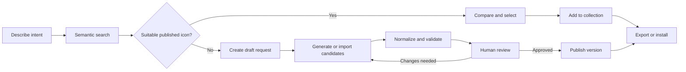
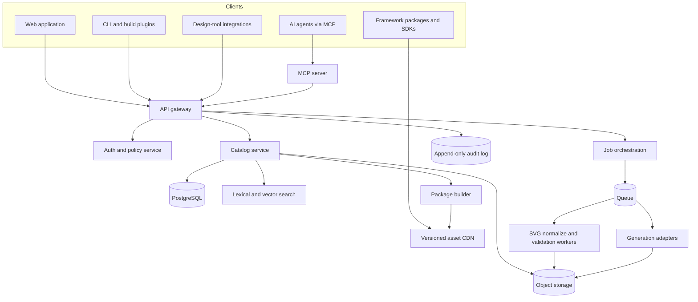

# Formaglyph — V1 Product Requirements Document

**Status:** Product baseline approved; implementation draft

**Date:** 20 July 2026

**Decision baseline:** Approved 20 July 2026

**Product name:** Formaglyph

**Primary domain:** `formaglyph.com` (reservation pending)

**Repository:** `Abib189/Formaglyph`

**Package scope:** `@formaglyph`

**Scope:** Twelve-week private-beta release

**Product owner:** TBD

## 1. Executive summary

Formaglyph is an open-source, AI-native system for finding, creating, validating, approving, and shipping coherent icon families. It combines the discoverability of an icon catalog, the constraints of a design-system compiler, and safe tools for designers, developers, and AI agents.

The product is not primarily an image generator. Its core promise is:

> Get the right production-ready icon into a product—consistent with its design system, licensed, reviewed, and available in code—in minutes rather than days.

The first release will support an original starter library, semantic and visual discovery, machine-readable style profiles, SVG normalization and validation, human-reviewed AI-assisted creation, versioned REST and MCP interfaces, project collections, and framework-ready exports.

## 2. Product thesis

Open icon libraries solve availability. Generators solve blank-canvas creation. Neither reliably solves the full design-system workflow:

1. Determine whether the icon already exists.
2. Select the semantically and visually correct icon.
3. Create a missing icon without breaking the family style.
4. Validate geometry, accessibility, licensing, and technical quality.
5. Review and approve the change.
6. Publish it consistently to design tools, code packages, and AI agents.
7. Preserve stable names and migration paths as the library evolves.

Formaglyph becomes the source of truth across those steps. Its defensible layer is the structured icon ontology, style grammar, validation pipeline, version history, and approval graph—not a single generation model.

## 3. Approved V1 baseline

The following decisions are the approved implementation baseline. Any change requires a written PRD amendment with product, design, and technical review.

- Platform code, APIs, CLI, MCP server, and validators use Apache-2.0. Original icon SVGs and generated framework packages use MIT. The Formaglyph name, logo, and brand assets remain reserved under a separate trademark policy.
- V1 ships at least 100 original production-quality icon concepts in both Regular and Solid variants, approximately 200 reviewed SVG assets, rather than repackaging a third-party catalog.
- The starter family uses a 24 × 24 viewBox, 20 × 20 normal live area, whole- and half-unit snapping, rounded caps and joins, and `currentColor` by default.
- The first customer is a small-to-medium product team maintaining a web design system.
- The primary surfaces are a responsive web application, REST API, CLI, JavaScript package, and MCP server.
- Figma and Penpot integrations begin with copy/export and deep links; full bidirectional sync is a post-beta milestone unless capacity permits.
- AI may propose assets and metadata. Publishing, deprecating, syncing, and overwriting remain human-approved operations.
- The private beta is hosted-first. Docker Compose supports local development and evaluation within the twelve-week build; production-grade self-hosting follows immediately after private beta and is not a V1 launch blocker.
- OmniSVG 1.1 4B is the default open reference generation adapter. StarVector 1B is the secondary image-to-SVG adapter. Hosted generation is project-level opt-in during private beta and never a silent fallback.
- English is the authoring language in V1, while aliases and metadata are designed for localisation.

### 3.1 Starter visual system

- **Canvas:** 24 × 24 viewBox with a normal 20 × 20 live area and approximately 2 units of breathing room on each edge. Optical corrections may cross the live area when documented.
- **Geometry:** whole- and half-unit snapping, restrained geometric construction, and optical correction at small sizes.
- **Regular:** independently drawn outline variant with a 2-unit stroke, rounded caps, and rounded joins.
- **Solid:** independently drawn filled variant. It must never be produced by an automated outline-to-fill conversion.
- **Corners:** external radii normally use 2 units; internal radii use 1 to 1.5 units unless legibility requires an approved exception.
- **Colour:** one `currentColor` channel by default.
- **Directionality:** every icon records whether it is neutral, LTR-specific, RTL-specific, or mirrored-safe.
- **V1 family:** Regular and Solid only. Light at 1.5 units, Bold at 2.5 units, Duotone, and optical-size masters move to post-V1 development.

## 4. Goals and non-goals

### 4.1 Goals

- Let a user find a suitable icon by intent, synonym, category, or visual similarity in under 30 seconds.
- Generate or import a missing icon as an editable SVG constrained by a project style profile.
- Automatically detect common SVG, geometry, accessibility, naming, provenance, and licensing issues.
- Require an accountable review before a new or materially changed icon becomes published.
- Keep one versioned catalog consumable by people, applications, design tools, build tools, and AI agents.
- Support stable identifiers and explicit deprecation/migration paths.
- Make local/private deployment possible without depending on a proprietary model.

### 4.2 Non-goals for V1

- Replacing general-purpose illustration or image-generation software.
- Producing photorealistic, multicolour, animated, 3D, or emoji-style artwork.
- Training a foundation model from scratch.
- Hosting a third-party icon marketplace.
- Providing a complete variable icon font.
- Supporting arbitrary collaborative vector editing comparable to Figma or Penpot.
- Allowing autonomous agents to publish to production without explicit policy and approval.

## 5. Users, roles, and permissions

### 5.1 Primary personas

| Persona | Job to be done | Current pain | V1 success |
|---|---|---|---|
| Product designer | Find or create an icon matching the system | Search terms fail; generated icons drift | Gets an editable, valid candidate with a clear comparison |
| Design-system maintainer | Govern quality and consistency | Reviews are subjective and history is scattered | Applies shared rules, reviews diffs, publishes a version |
| Frontend developer | Add icons without bundle or naming problems | Design and package assets drift | Installs or imports the exact approved asset |
| Product engineer using an agent | Let an agent select icons safely | Agent guesses names or embeds untrusted SVG | Agent searches structured metadata and creates a proposal |
| Open-source contributor | Add icons to the public family | Guidelines and tests are difficult to follow | Submits a machine-checked proposal with provenance |

### 5.2 Roles

| Capability | Guest | Member | Contributor | Reviewer | Admin | Agent/service account |
|---|:---:|:---:|:---:|:---:|:---:|:---:|
| Browse public icons | ✓ | ✓ | ✓ | ✓ | ✓ | Scoped |
| Export public icons | ✓ | ✓ | ✓ | ✓ | ✓ | Scoped |
| Access private project | — | ✓ | ✓ | ✓ | ✓ | Scoped |
| Create collection | — | ✓ | ✓ | ✓ | ✓ | Scoped |
| Import/generate draft | — | ✓ | ✓ | ✓ | ✓ | Draft-only by default |
| Edit metadata/style draft | — | — | ✓ | ✓ | ✓ | Scoped |
| Review proposal | — | — | — | ✓ | ✓ | — by default |
| Publish/deprecate | — | — | — | Policy-based | ✓ | Explicit privileged scope |
| Manage users, keys, billing | — | — | — | — | ✓ | — |

Every privileged action records actor type, actor ID, request origin, affected version, approval, and timestamp.

### 5.3 Private-beta cohort

Recruit five accessible teams that can join a weekly feedback session and permit workflow observation. The first three validate daily usability; the final two stress openness and agent safety.

| Cohort | Typical stack | Primary learning goal |
|---|---|---|
| B2B SaaS team with an existing component library | React, Next.js, Tailwind CSS, Storybook, Figma | Search, naming, packages, release governance |
| Growing startup without a dedicated icon designer | React, Vite, shadcn/ui, Figma | Generation quality, onboarding, and time to usable asset |
| Vue product team | Vue, Nuxt, Storybook, Figma | Framework neutrality, raw SVG, and Iconify interoperability |
| Open-design or open-source team | React or Svelte, Penpot, GitHub | Contribution flow, licensing, Penpot handoff, and self-host expectations |
| Agent-native product team | Next.js, MCP-compatible agents, VS Code or agentic coding tools, Figma | Tool discovery, proposal-only mutations, approval, and audit safety |

## 6. Jobs and user stories

### 6.1 Discovery

- As a designer, I can search “payment successful” and get semantically related icons even if those exact words are not in their names.
- As a developer, I can filter results by style, weight, category, licence, directionality, and supported package.
- As a user, I can compare icons at 16, 20, 24, and 32 pixels before choosing one.
- As an agent, I receive structured candidates with confidence, rationale, stable IDs, and licence data—not only SVG strings.

### 6.2 Creation

- As a designer, I can describe a missing concept, choose a style profile, and generate several editable SVG candidates.
- As a maintainer, I can request a complete state family such as upload, uploading, success, failure, and disabled.
- As a contributor, I can import an SVG and receive a normalized draft with a non-destructive before/after comparison.

### 6.3 Validation and governance

- As a reviewer, I can see rule violations, perceptual comparisons, metadata changes, and source/provenance before approving.
- As an admin, I can enforce different policies for brand icons, public assets, private projects, and AI-generated drafts.
- As a developer, I receive a migration mapping when an icon is renamed or deprecated.

### 6.4 Distribution

- As a developer, I can copy SVG, install a package, import a tree-shakeable component, or fetch a versioned asset URL.
- As a designer, I can copy a vector into a design tool while preserving naming and metadata.
- As an agent, I can request framework-specific usage that references a published icon rather than inventing inline SVG.

## 7. End-to-end workflows

### 7.1 Retrieve before generate



The product always shows relevant existing assets before exposing generation. This reduces duplicates, review load, cost, and semantic inconsistency.

### 7.2 Project audit

1. User connects or uploads a code manifest.
2. Scanner identifies icon imports, inline SVG, aliases, missing assets, and deprecated IDs.
3. Product maps discovered assets to the registry.
4. User sees duplicates, inconsistent families, licence risks, and migration recommendations.
5. User generates a patch plan or export manifest. V1 does not edit a repository without an explicit external action and scope.

### 7.3 Agent proposal

1. Agent calls `search_icons` with intent and project ID.
2. Server returns ranked published assets and explains material constraints.
3. If no asset passes the threshold, agent calls `draft_icon`.
4. Server creates an asynchronous generation job and proposal.
5. Agent calls `validate_icon`, then links the proposal to the user.
6. Reviewer approves or requests changes in the web application.
7. A privileged user or scoped automation publishes the approved version.

## 8. Information architecture and screens

### 8.1 Public Explore

**Purpose:** Search and evaluate the public library.

**Required elements:**

- Intent search with query suggestions and synonym expansion.
- Filters for family, style, weight, category, licence, and directionality.
- Size preview selector and light/dark contrast backgrounds.
- Result cards showing name, preview, style, status, and quick copy.
- Keyboard navigation and command palette.
- “No exact match” state that recommends related concepts before generation.

**States:** initial, searching, results, no exact match, zero results, offline/error, rate-limited.

### 8.2 Icon detail

**Purpose:** Establish the authoritative record for an icon.

**Required elements:**

- Preview at standard UI sizes and contexts.
- Stable ID, canonical name, aliases, concept, states, style, version, and status.
- SVG path/markup and framework usage tabs.
- Licence, provenance, AI disclosure, contributor, and source revision.
- Optical/geometry measurements and validation result.
- Version history, deprecation notice, and replacement mapping.
- Actions: copy, download, add to collection, compare, propose edit.

### 8.3 Project dashboard

**Purpose:** Show a team’s icon system health and current work.

**Required elements:**

- Active style profile and current published library version.
- Recent proposals, review queue, failed validations, and integration status.
- Usage summary, unregistered icon count, deprecated icon count, and zero-result searches.
- Actions: search, create draft, import, audit project, build package.

### 8.4 Style profile editor

**Purpose:** Define the machine-readable constraints for a family.

**Required elements:**

- Grid/viewBox, safe area, stroke caps/joins, stroke range, corner radius set, alignment rules, fill rules, layer rules, optical corrections, colour policy, and minimum size.
- Named weights and mappings between them.
- Reference icons with approved/anti-reference annotations.
- Live rule tests against selected icons.
- Versioned draft/publish flow with impact report.

V1 provides form-based rule editing and JSON import/export. It is not a general vector editor.

### 8.5 Creation studio

**Purpose:** Turn a concept or imported SVG into a reviewable proposal.

**Required elements:**

- Concept, intended UI action/object, state, directionality, and exclusions.
- Style profile and reference selection.
- Import SVG or choose generation adapter.
- Candidate grid with rerun, refine, compare, and discard controls.
- Editable name, aliases, tags, accessibility guidance, and provenance.
- Validation panel and rendered preview at standard sizes.
- “Create proposal” as the final action; no direct publish for normal users.

### 8.6 Review queue and proposal detail

**Purpose:** Make approval fast, explainable, and auditable.

**Required elements:**

- Filters by project, contributor, risk, age, validation state, and asset type.
- SVG overlay/difference view against nearest family icons.
- Metadata and geometry diff.
- Validation groups with severity and remediation.
- Comments, requested changes, approval, rejection, and conflict resolution.
- Publish target and semantic version impact.

### 8.7 Collection and package builder

**Purpose:** Ship a curated subset without unnecessary bundle weight.

**Required elements:**

- Collection contents, version pin, aliases, and replacement warnings.
- Output targets: raw SVG, Iconify-compatible JSON, React, Vue, Svelte, sprite, CSS mask, and PNG.
- Tree-shaking/bundle estimate and reproducible manifest.
- Build status, checksum, changelog, and versioned download URL.

### 8.8 Integrations and access

**Purpose:** Connect code, design, automation, and agents.

**Required elements:**

- API keys and OAuth clients with scopes, expiry, last use, and revocation.
- MCP connection instructions and tool-scope preview.
- CLI token setup and package registry configuration.
- Webhooks, build hooks, and audit log.
- Figma/Penpot export or plugin connection status.

## 9. Functional requirements

### 9.1 Catalog and search

| ID | Requirement | Priority | Acceptance criterion |
|---|---|---|---|
| CAT-001 | Store every icon under a stable immutable ID | P0 | Renaming never changes ID or breaks pinned URLs |
| CAT-002 | Support canonical names, aliases, deprecated aliases, tags, categories, and concepts | P0 | All fields are searchable and versioned |
| CAT-003 | Represent related icons and state families | P0 | Detail view can traverse every sibling state |
| CAT-004 | Capture licence and provenance per version | P0 | An asset cannot publish without required provenance fields |
| SRCH-001 | Full-text and semantic search | P0 | Top 10 contains a reviewed relevant result for ≥85% of beta benchmark queries |
| SRCH-002 | Faceted filtering and deterministic sorting | P0 | Filter state is linkable and API-equivalent |
| SRCH-003 | Visual similarity search | P1 | User can find nearest published geometry from an uploaded SVG |
| SRCH-004 | Explain ranking | P0 | API and UI provide matched terms/concepts and material filter decisions |

### 9.2 Style, creation, and validation

| ID | Requirement | Priority | Acceptance criterion |
|---|---|---|---|
| STY-001 | Versioned style profile | P0 | Every icon version references exactly one profile version |
| STY-002 | Reference and anti-reference icons | P0 | Creation request can include both and records them in provenance |
| GEN-001 | Adapter-based generation jobs | P0 | At least one local/open and one hosted adapter can satisfy a common job contract |
| GEN-002 | Import and normalize SVG | P0 | Original remains available; normalized output is reproducible |
| GEN-003 | Generate coherent state family | P1 | One request can produce linked candidates for at least three states |
| GEN-004 | Async job cancellation and retry | P0 | Jobs expose status, progress, cancellation, and structured failures |
| VAL-001 | SVG security and structural checks | P0 | Scripts, event handlers, external references, and unsafe constructs are rejected |
| VAL-002 | Geometry/style checks | P0 | Grid, bounds, strokes, joins, caps, colours, path count, and minimum size are evaluated |
| VAL-003 | Raster preview regression | P0 | Every proposal renders at 16, 20, 24, and 32 px on light/dark backgrounds |
| VAL-004 | Naming, metadata, licence, and provenance checks | P0 | Missing blocking fields prevent proposal approval |
| VAL-005 | Actionable diagnostics | P0 | Each failure includes severity, path/location where possible, and remediation text |

### 9.3 Review, versioning, and distribution

| ID | Requirement | Priority | Acceptance criterion |
|---|---|---|---|
| REV-001 | Proposal workflow | P0 | Draft → in review → changes requested/approved/rejected → published is enforced |
| REV-002 | Required reviewer policy | P0 | Project can require one or more non-author reviewers |
| REV-003 | Immutable audit trail | P0 | Actor, time, input, decision, and target version are retained |
| VER-001 | Semantic library releases | P0 | Added, changed, renamed, and removed assets produce a deterministic changelog |
| VER-002 | Deprecation and replacement mapping | P0 | Deprecated icon remains resolvable and points to replacement when available |
| DIST-001 | Reproducible package builds | P0 | Same manifest and source version produce the same content hashes |
| DIST-002 | Raw SVG, Iconify JSON, and React output | P0 | Beta project can consume each output with documented examples |
| DIST-003 | Vue, Svelte, sprite, CSS mask, PNG | P1 | Outputs pass snapshot and package smoke tests |
| DIST-004 | CDN asset URLs with immutable versions | P0 | Published URL content cannot change in place |

### 9.4 Project audit and integrations

| ID | Requirement | Priority | Acceptance criterion |
|---|---|---|---|
| AUD-001 | Scan a manifest or source archive for icon usage | P1 | Produces asset, alias, inline SVG, and unknown-use inventory |
| AUD-002 | Recommend migrations | P1 | Report includes replacements and confidence without modifying source |
| INT-001 | API keys with granular scopes | P0 | Keys are revocable and never reveal their plaintext after creation |
| INT-002 | Webhooks for proposal/release/job events | P1 | Signed events are retried and observable |
| INT-003 | Copy/export path for Figma and Penpot | P0 | User can transfer a named vector with version metadata |

## 10. Search relevance specification

Candidate retrieval combines:

1. Exact stable ID and canonical-name match.
2. Exact alias and deprecated-alias match.
3. Token and prefix full-text match.
4. Concept/category/state graph expansion.
5. Semantic embedding similarity.
6. Optional visual similarity for uploaded SVG.

The reranker applies project style compatibility, publication status, locale, directionality, licence policy, intended action/object, popularity within the project, and deprecation penalties.

The API returns a normalized score, matched fields, style compatibility, policy exclusions, and a short rationale. Popularity must never override a clearly better semantic match. Private project data must not improve global rankings without opt-in aggregation.

The beta benchmark will contain at least 200 queries covering synonyms, user intents, objects, actions, states, misspellings, cultural ambiguity, and “no suitable icon” cases. Reviewers assign acceptable result sets rather than one brittle golden answer.

## 11. Style grammar and validation

A style profile is a versioned machine-readable contract containing:

- Coordinate system: viewBox, target sizes, keylines, safe area, optical bounds.
- Geometry: preferred primitives, minimum gaps, alignment tolerance, allowed overlaps, path complexity.
- Stroke: named weights, width, cap, join, miter limit, scaling behaviour.
- Corners: allowed radii and exceptions.
- Fill and layers: outline/fill rules, duotone layer semantics, opacity limits, knockout rules.
- Semantics: directionality, state-family conventions, forbidden metaphors, brand separation.
- Colour: single-current-colour default, optional secondary layer tokens, contrast preview rules.
- Delivery: required optimization profile, precision, metadata policy, supported formats.
- References: positive examples, anti-examples, and written exception notes.

Validation produces four severities:

- **Blocker:** unsafe SVG, missing licence/provenance, invalid viewBox, external resource, unreviewed privileged change.
- **Error:** out-of-bounds geometry, unsupported colour, broken path, style profile mismatch beyond tolerance.
- **Warning:** unusual complexity, weak small-size legibility, near-duplicate, ambiguous name.
- **Info:** optimization opportunity or optional metadata suggestion.

Automatic fixes must be explicit, reversible, and shown in the proposal diff.

## 12. Core data model

### 12.1 Entities

| Entity | Required fields |
|---|---|
| `Organization` | id, name, slug, plan, settings, created_at |
| `Project` | id, organization_id, name, visibility, default_style_profile_version_id, policy_id |
| `User` | id, identity_provider_id, display_name, status |
| `Membership` | organization_id/project_id, principal_id, role, created_at |
| `Icon` | id, project_id, canonical_name, status, current_version_id, created_at |
| `IconVersion` | id, icon_id, version, style_profile_version_id, source_svg_id, optimized_svg_id, metadata, provenance, licence_snapshot_id, validation_run_id, content_hash, created_by |
| `IconAlias` | icon_id, alias, locale, kind, valid_from, valid_to |
| `Concept` | id, canonical_label, description, locale, parent_id |
| `IconConcept` | icon_id, concept_id, relationship, confidence, reviewed |
| `IconRelation` | source_icon_id, target_icon_id, type, order |
| `StyleProfile` | id, project_id, name, current_version_id |
| `StyleProfileVersion` | id, profile_id, version, rules_json, reference_icon_ids, anti_reference_icon_ids, status |
| `Proposal` | id, project_id, type, status, base_version_id, candidate_version_id, author_principal_id, risk_level |
| `Review` | proposal_id, reviewer_id, decision, comments, created_at |
| `ValidationRun` | id, target_type, target_id, validator_version, status, summary, created_at |
| `ValidationIssue` | run_id, rule_id, severity, location, message, remediation, auto_fix_id |
| `GenerationJob` | id, project_id, adapter, model, prompt_spec, references, status, cost, started_at, finished_at |
| `AssetBlob` | id, storage_key, mime_type, byte_size, sha256, sanitization_status |
| `LicenceSnapshot` | id, spdx_expression, licence_text_hash, source_url, captured_at, trademark_notes |
| `Collection` | id, project_id, name, version, icon_version_ids, build_manifest |
| `Release` | id, project_id, version, collection_id, changelog, content_hash, published_at |
| `ApiCredential` | id, organization_id, principal_id, scopes, expires_at, revoked_at |
| `AuditEvent` | id, actor, action, target, request_id, source, metadata, created_at |

### 12.2 Canonical icon representation

```json
{
  "id": "ico_01J...",
  "name": "cloud-upload",
  "aliases": ["upload-cloud", "cloud-arrow-up"],
  "concepts": ["cloud-storage", "upload"],
  "categories": ["files", "arrows"],
  "role": "action",
  "state": "default",
  "directionality": "neutral",
  "style": { "profile": "core", "version": "1.0.0", "weight": "regular" },
  "geometry": { "viewBox": "0 0 24 24", "opticalBounds": [2, 3, 22, 21], "minimumSize": 16 },
  "assets": { "sourceSvg": "asset_...", "optimizedSvg": "asset_..." },
  "licence": { "spdx": "MIT", "snapshot": "lic_..." },
  "provenance": { "method": "human-ai-assisted", "generator": "adapter/model/version", "references": [] },
  "review": { "status": "published", "proposal": "prp_...", "approvedBy": ["usr_..."] },
  "version": "1.2.0",
  "sha256": "..."
}
```

## 13. REST API contract

### 13.1 Conventions

- Base path: `/v1`.
- JSON by default; SVG/PNG endpoints negotiate media types.
- Cursor pagination for lists.
- Bearer credentials with project and action scopes.
- `Idempotency-Key` required for generation, proposal, approval, and publish mutations.
- Every response includes `request_id`; async mutations return a job or operation resource.
- Errors use stable machine codes, human messages, optional field pointers, and retry guidance.
- Published icon/version URLs are immutable. Mutable aliases redirect or resolve explicitly.

### 13.2 Read endpoints

| Method | Path | Purpose |
|---|---|---|
| GET | `/icons` | Filter and list published or permitted icons |
| GET | `/icons/{icon_id}` | Inspect the authoritative icon record |
| GET | `/icons/{icon_id}/versions` | List history and migration data |
| GET | `/search` | Semantic, lexical, and filtered search |
| POST | `/visual-search` | Find similar icons from sanitized SVG |
| GET | `/styles` | List available style profiles |
| GET | `/styles/{style_id}/versions/{version}` | Read style contract |
| GET | `/collections/{collection_id}` | Read collection and build manifest |
| GET | `/releases/{release_id}` | Read immutable release and changelog |
| GET | `/licences/{snapshot_id}` | Read licence snapshot and source |

### 13.3 Mutation and job endpoints

| Method | Path | Purpose |
|---|---|---|
| POST | `/render` | Render a permitted icon at a target format/size |
| POST | `/validate` | Validate SVG or a registered asset |
| POST | `/compare` | Produce structural and rendered comparison |
| POST | `/generation-jobs` | Create an async candidate generation job |
| GET | `/generation-jobs/{job_id}` | Read status, cost, results, and failures |
| POST | `/generation-jobs/{job_id}/cancel` | Cancel queued/running job |
| POST | `/generation-jobs/{job_id}/refinements` | Create constrained follow-up job |
| POST | `/proposals` | Create a reviewable catalog/style change |
| POST | `/proposals/{proposal_id}/reviews` | Approve, reject, or request changes |
| POST | `/proposals/{proposal_id}/publish` | Publish approved proposal with privileged scope |
| POST | `/collections/{collection_id}/builds` | Build versioned distribution artifacts |
| POST | `/audits` | Scan an uploaded manifest or permitted project snapshot |

Suggested scopes include `icons:read`, `styles:read`, `assets:render`, `drafts:write`, `proposals:write`, `reviews:write`, `releases:publish`, `projects:audit`, and `admin:*`.

## 14. MCP and agent contract

### 14.1 Principles

- Use the official Model Context Protocol SDK and version the server independently from the REST API.
- Prefer references to immutable published assets over returning arbitrary inline SVG.
- Mark tools with correct read-only/destructive/idempotent/open-world annotations.
- Require explicit scopes and human approval for publish, sync, deprecate, or source-writing operations.
- Bound all output and validate every SVG and URL crossing the trust boundary.
- Return structured content plus concise human-readable summaries.

### 14.2 Read-only tools

| Tool | Core input | Core output |
|---|---|---|
| `search_icons` | query, project_id, filters, limit | ranked icons, reasons, policy notes |
| `inspect_icon` | icon_id, version | metadata, asset references, validation, licence |
| `compare_icons` | icon/version IDs, sizes | geometry/render differences and recommendation |
| `recommend_icons` | UI intent, context, platform | candidates with semantic rationale |
| `list_style_profiles` | project_id | profiles, versions, supported weights |
| `get_usage_snippet` | icon_id, target, version | package/import snippet and requirements |
| `audit_project_icons` | audit_id or permitted manifest | duplicates, unknowns, deprecations, migrations |
| `check_icon_license` | icon/version ID, intended use | stored facts, policy result, review warning |

### 14.3 Draft/proposal tools

| Tool | Core input | Core output |
|---|---|---|
| `draft_icon` | concept, context, project/style, references | async job and draft proposal IDs |
| `draft_state_family` | base concept, required states, style | linked jobs and family proposal |
| `refine_candidate` | candidate ID, requested delta | new candidate preserving history |
| `normalize_svg` | SVG asset, target style | sanitized normalized draft and changes |
| `validate_icon` | asset/candidate, style version | validation run and issues |
| `create_proposal` | candidate, metadata, target | proposal with missing requirements |

### 14.4 Privileged tools

`approve_proposal`, `publish_icon`, `deprecate_icon`, `sync_design_library`, and `write_project_assets` are disabled by default. Enabling one requires a separately granted scope, clear confirmation in the host, policy evaluation, idempotency, and a complete audit event.

### 14.5 Resources and MCP App

Expose read-only MCP resources for project style guides, catalog indexes, release manifests, migration guides, and framework documentation. Provide an MCP App that can render:

- Search results with size/context previews.
- Candidate comparison and validation details.
- Proposal status and human approval handoff.

The App must treat tool results as untrusted, use restrictive content security policy settings, and never place secrets in client-visible metadata.

## 15. Technical architecture



### 15.1 Recommended implementation choices

- TypeScript end to end for the first release, with a React/Next.js web application.
- PostgreSQL for relational catalog and policy data; `pgvector` initially for semantic search.
- Object storage for source SVG, optimized SVG, previews, diffs, and packages.
- Iconify-compatible JSON as one interoperability format, not the canonical database model.
- SVGO plus custom deterministic geometry/style checks; resvg-compatible rendering for previews.
- A queue-backed worker boundary for generation, rendering, validation, audit, and package builds.
- Adapter interface for local/open and hosted models to avoid product coupling to one vendor. The reference implementation targets OmniSVG 1.1 4B for text-to-SVG and image-to-SVG, with StarVector 1B as a secondary image-to-SVG/vectorization adapter.
- OpenAPI-generated SDK foundation; official JavaScript SDK first.
- OpenTelemetry-compatible traces, metrics, and structured logs with request/job correlation IDs.

### 15.2 Deployment boundary

- Run the private beta as a managed multi-tenant service so onboarding, observation, and iteration remain fast.
- Ship a documented Docker Compose environment within the twelve-week build for contributors, local development, security review, and evaluation deployments.
- Keep the runtime portable across PostgreSQL, S3-compatible object storage, a standard queue abstraction, and OpenAPI contracts. P0 architecture must not require an undocumented hosted-only dependency.
- Allow projects to export their assets, metadata, style profiles, licence snapshots, and release manifests.
- Deliver production-grade self-hosting templates and admin tooling immediately after private beta as a P1 commitment, not a private-beta launch gate.

## 16. Accessibility, internationalisation, and semantics

- All web flows meet WCAG 2.2 AA for keyboard access, focus, contrast, naming, errors, and reduced motion.
- Decorative-icon snippets default to hidden semantics; meaningful-icon snippets require a label supplied by the consuming product.
- The product never assumes an icon alone communicates critical state.
- Every icon declares directionality: neutral, LTR-specific, RTL-specific, or mirrored-safe.
- Search aliases support locale and review state. V1 ships English but does not encode aliases as an English-only array.
- Validation previews include colour contrast contexts, but icons inheriting `currentColor` cannot guarantee consumer contrast; documentation must say so.
- Culturally sensitive or ambiguous metaphors can carry locale warnings and recommended alternatives.

## 17. Security, privacy, safety, and legal controls

### 17.1 SVG and supply-chain safety

- Parse and rebuild SVG with an allowlist; never trust regex sanitization alone.
- Remove scripts, event handlers, foreign objects, external references, unsafe URLs, and unsupported filters.
- Apply decompression, path-count, file-size, dimension, timeout, and memory limits.
- Sandbox renderers and generation adapters away from application credentials.
- Sign package manifests and publish checksums. Produce an SBOM for released code/packages.

### 17.2 AI and data governance

- Record model/adapter/version, prompt specification hash, references, transformations, and human decisions.
- Project content is private by default and excluded from model training and shared ranking unless explicitly opted in.
- OmniSVG 1.1 4B is the default open reference adapter and runs as a separately deployed model service rather than an assumed laptop dependency. StarVector 1B is maintained as the secondary image-to-SVG adapter.
- Hosted generation is enabled only after an administrator opts in at the project level. The interface identifies the provider before data is sent, and the system never silently falls back from an open/self-hosted adapter to a hosted provider.
- Private references may be sent to a hosted provider only when the project policy explicitly permits it. Provider, model, prompt hash, reference IDs, retention terms, and deletion status are recorded for every hosted job.
- Hosted provider selection must use a documented 50-to-100-prompt benchmark covering visual quality, SVG validity, latency, privacy terms, and cost.
- Every generated result is a draft. It must pass sanitization, normalization, deterministic validation, and human review before publication; generation tools can never auto-publish.
- Administrators can disable hosted adapters and require open/self-hosted generation.
- Detect likely near-copies and reference leakage before review, while acknowledging that automated similarity is not a legal conclusion.
- Clearly label AI-assisted assets and preserve the human editor/reviewer chain.

### 17.3 Licensing and brands

- Capture SPDX expression, full licence snapshot hash, source URL, author, retrieval date, modifications, and attribution obligations per asset version.
- Brand/trademark icons live in a separate lane with stricter publication and usage notices.
- Do not claim that an open-source licence grants trademark rights.
- License platform code, APIs, CLI, MCP server, validators, and supporting developer tooling under Apache-2.0.
- License Formaglyph's original icon SVGs, metadata bundles, and generated framework packages under MIT. Redistributed packages retain their licence and attribution notices; products using the icons do not need to display attribution in their interface.
- Reserve the Formaglyph word mark, logo, and brand presentation under a separate trademark policy. Third-party and brand icons carry separate per-asset licence and trademark records and are never implied to inherit the MIT asset licence.
- Complete legal review of the licence files, package notices, contribution terms, and trademark policy before public release; the review verifies this approved structure rather than reopening the product decision.
- Use Developer Certificate of Origin sign-off for contributions initially; revisit CLA only if governance or commercial requirements justify it.

## 18. Non-functional requirements

| Area | Beta target |
|---|---|
| Search latency | p95 < 500 ms for normal filtered search |
| Published SVG delivery | p95 < 150 ms from CDN in supported regions |
| API availability | 99.9% monthly excluding announced maintenance |
| Job durability | No acknowledged job lost; retryable operations are idempotent |
| Search freshness | Published catalog change visible within 60 seconds |
| Package reproducibility | 100% identical content hashes for same manifest/tool versions |
| Accessibility | No critical/serious automated issues and completed manual keyboard/screen-reader pass on P0 flows |
| Audit | 100% of privileged mutations emit durable audit event |
| Backup | Daily full + continuous point-in-time recovery; restore drill before public beta |
| Browser support | Current and previous major versions of Chrome, Safari, Firefox, and Edge |

## 19. Analytics and success measures

### 19.1 North-star metric

**Approved icon outcomes per active project per week:** the count of published-icon selections or approved proposals that are subsequently exported, installed, or referenced by a project.

This measures useful adoption without rewarding low-quality generation volume.

### 19.2 Beta metrics

Targets below are hypotheses to validate with at least five design-system teams.

| Metric | Initial target |
|---|---:|
| Median time from search start to selected published icon | < 30 seconds |
| Benchmark queries with acceptable result in top 10 | ≥ 85% |
| Search sessions ending in zero results | < 10% |
| Needs satisfied by reuse rather than generation | ≥ 70% |
| Draft proposals passing all blockers after one iteration | ≥ 80% |
| Median draft-to-review-ready time | < 5 minutes excluding queue delay |
| Median review handling time | < 3 minutes |
| Published assets with complete licence/provenance | 100% |
| Privileged mutations with audit event | 100% |
| Weekly active beta projects exporting/installing an asset | ≥ 60% |

### 19.3 Product events

Track `search_submitted`, `search_result_opened`, `icon_selected`, `icon_exported`, `collection_built`, `generation_started`, `candidate_refined`, `validation_completed`, `proposal_created`, `review_decided`, `release_published`, `api_request_completed`, `mcp_tool_completed`, and `audit_issue_resolved`.

Event properties must use stable IDs, avoid raw prompts or SVG by default, and apply tenant retention policy.

## 20. Open-source product model and governance

### 20.1 Proposed repository layout

```text
apps/web                 Hosted and self-hosted web application
apps/docs                Product and API documentation
services/api             REST API and policies
services/mcp             MCP server and App resources
services/worker          Validation, generation, build, and audit jobs
packages/schema          Canonical TypeScript/JSON schemas
packages/icons           Original public icon assets and metadata
packages/react           Tree-shakeable React components
packages/cli             Import, validate, audit, and build commands
packages/validators      Deterministic validation rules
packages/sdk-js          Generated/handwritten JavaScript client
```

### 20.2 Governance

- Publish design rules, contribution guide, review rubric, security policy, and release policy.
- Require automated validation and visual snapshots on asset changes.
- Maintain a small reviewer group for semantic and visual consistency; publish reviewer decisions and exceptions.
- Use request-for-comment documents for schema, licence, naming, and style-profile changes.
- Separate community asset governance from hosted-service operations.

### 20.3 Commercial boundary

Keep the canonical schema, catalog UI, validators, local CLI, MCP server, starter icons, and self-hosting path open. Potential paid value can include managed hosting, private teams, advanced permissions, hosted model credits, large-scale audits, premium integrations, SLA/support, and enterprise policy controls. Avoid making basic export or safe local use dependent on the hosted service.

## 21. Twelve-week delivery plan

Assumes one product/design lead, one icon designer, two full-stack engineers, one backend/platform engineer, and part-time ML/AI and accessibility/QA support. With a smaller team, remove P1 work before compressing validation or review controls.

| Week | Focus | Deliverables | Exit criteria |
|---:|---|---|---|
| 1 | Product and style foundation | Recruit beta cohort, define benchmark tasks, ontology v0, codify approved visual grammar, add licence and trademark files | Approved scope and measurable benchmark |
| 2 | Schema and design grammar | Canonical schema, style-profile schema, permissions, proposal state machine, first 20 concepts in Regular and Solid | Schemas reviewed; 40 reference assets pass manual rubric |
| 3 | Asset pipeline | SVG ingest, sanitization, normalization, hashing, storage, base validators | Unsafe test corpus rejected; transformations reproducible |
| 4 | Catalog and search | Catalog APIs, full-text/semantic indexing, benchmark harness, admin import | ≥75% top-10 benchmark on initial data |
| 5 | Explorer UX | Public Explore, filters, result previews, keyboard navigation, empty/error states | Core discovery usability test completed |
| 6 | Detail and starter set | Icon detail, copy/download, version/provenance views, 100-concept starter target in Regular and Solid | Approximately 200 SVG assets validated and documented |
| 7 | Developer surfaces | REST v1 read endpoints, JS SDK seed, CLI search/get/validate, read-only MCP tools | Sample app consumes pinned assets via each surface |
| 8 | Projects and packaging | Projects, roles, collections, React/raw SVG/Iconify builds, immutable CDN releases | Reproducible collection release succeeds end to end |
| 9 | Creation studio | Import flow, generation adapter contract, OmniSVG 1.1 4B reference adapter, StarVector 1B secondary adapter, opt-in hosted adapter, candidate comparison | User creates a validated draft without database/manual intervention |
| 10 | Review and governance | Proposals, validation UI, comments, approval, publish/deprecate, audit log | Normal user cannot bypass review; release changelog generated |
| 11 | Agent and design handoff | Draft MCP tools, proposal handoff App, Figma/Penpot copy/export metadata, scoped credentials | Agent completes retrieve-or-propose flow with human approval |
| 12 | Hardening and private beta | Accessibility pass, security tests, backup/restore drill, observability, Docker Compose evaluation deployment, docs, contributor guide, beta onboarding | Launch checklist passes; five teams invited |

### 21.1 Scope cut order

If delivery slips, cut in this order:

1. Visual similarity search.
2. Project source audit.
3. Vue/Svelte/sprite/CSS-mask/PNG outputs beyond raw SVG, Iconify JSON, and React.
4. Hosted generation adapter; preserve import and local/open adapter.
5. MCP App rich comparison; preserve structured MCP tools and web deep link.

Do not cut SVG sanitization, provenance, proposal review, immutable releases, or audit logging.

## 22. Testing and release gates

### 22.1 Automated tests

- Schema fixtures and migration tests.
- Search benchmark and relevance-regression suite.
- Malicious and malformed SVG corpus.
- Validator unit/property tests and deterministic snapshot tests.
- Raster previews at supported sizes, themes, and pixel densities.
- Package build reproducibility and framework smoke tests.
- REST contract, permission, rate-limit, idempotency, and job retry tests.
- MCP tool schemas, annotations, scope enforcement, and untrusted-output tests.
- Accessibility automation plus manual screen-reader/keyboard scripts.

### 22.2 Private-beta launch checklist

- 100 original concepts, each approved in Regular and Solid, under the published style guide.
- Asset and code licences selected and included in repositories/packages.
- P0 workflows pass on desktop and narrow responsive layout.
- All critical/high security findings resolved.
- No known blocker SVG-sanitization bypass.
- Search benchmark reaches ≥85% acceptable top-10 result.
- Five beta teams can onboard without internal database access.
- API, CLI, package, MCP, contribution, privacy, and incident documentation published.
- Backup restore and credential-revocation drills completed.
- Telemetry dashboards and alert ownership assigned.

## 23. Key risks and mitigations

| Risk | Impact | Mitigation |
|---|---|---|
| Generated vectors appear plausible but fail at UI sizes | User distrust and rework | Reference-constrained creation, multi-size previews, hard validation, human review |
| Search creates duplicates instead of finding existing assets | Catalog fragmentation | Retrieve-first flow, near-duplicate checks, zero-result analytics, ontology review |
| Style grammar becomes too rigid | Expressive icons require exceptions | Versioned exception mechanism with reviewer note and reference example |
| Model/vendor dependence | Cost, privacy, and continuity risk | Adapter contract, local/open path, stored prompts/specs, deterministic post-processing |
| Licence or trademark ambiguity | Legal/reputation risk | Per-version snapshots, brand lane, publish blockers, legal disclaimer and review |
| Agent has excessive write power | Accidental production change | Least-privilege scopes, proposal-first tools, host confirmation, idempotency, audit |
| Public contribution volume overwhelms reviewers | Slow releases | Machine checks, required metadata, contributor reputation, batch review tooling |
| Code and design assets drift | Incorrect product UI | Stable IDs, release manifests, design metadata, audit and migration reports |
| Open core feels crippled | Community rejection | Keep core workflow, validators, MCP, CLI, starter set, and self-hosting open |

## 24. P0, P1, and later backlog

### P0 — private beta

- Original 100-concept set in Regular and Solid, approximately 200 SVG assets, plus the style guide.
- Canonical registry, ontology, versioning, licence/provenance.
- Full-text + semantic search and filters.
- Import, normalization, validation, rendered previews.
- Style profiles, proposal/review/publish workflow, audit log.
- Raw SVG, Iconify JSON, React package/collection builds.
- REST read APIs and core mutations.
- MCP search/inspect/recommend/usage plus draft/validate/proposal.
- Project roles, scoped credentials, responsive accessible web UI.
- Managed private-beta deployment and documented Docker Compose environment for development and evaluation.

### P1 — first public beta

- Visual similarity, project audit, migrations, state-family drafting.
- Vue, Svelte, sprite, CSS mask, and PNG outputs.
- Rich MCP App comparison and approval handoff.
- Penpot plugin and deeper Figma integration.
- Webhooks, GitHub Action, Vite/unplugin-style build integration.
- Self-hosted deployment templates and admin tooling.

### Later

- Optical-size masters and additional weights.
- React Native, Flutter, SwiftUI, Android, and variable-font outputs.
- Localised ontology and culturally reviewed alternatives.
- Marketplace/private asset exchange, if governance and economics support it.
- Fine-tuning or training specialised generation models once enough consented, reviewed data exists.
- Enterprise SSO/SCIM, regional hosting, advanced approval policies, and SLA controls.

## 25. Approved product decisions

1. **Name:** Formaglyph. Use `formaglyph.com`, `formaglyph/formaglyph`, the `@formaglyph` package scope, and `formaglyph` as the CLI command. Reserve the identifiers and complete UK, EU, and US trademark screening before a public announcement.
2. **Starter visual direction:** use a 24 × 24 grid with a normal 20 × 20 live area, Regular outline at a 2-unit rounded stroke, and an independently drawn Solid variant. Use controlled rounded corners and `currentColor`; defer Light, Bold, Duotone, and optical-size masters until after V1.
3. **Licensing:** use Apache-2.0 for the platform and developer tooling, MIT for original icons and generated packages, a separate trademark policy for the Formaglyph brand, and DCO sign-off for contributions.
4. **Beta audience:** recruit the five cohorts defined in Section 5.3, spanning React/Figma, startup, Vue, Penpot/open-source, and MCP/agent-native workflows.
5. **Deployment:** launch the private beta as a managed hosted service, provide Docker Compose for development and evaluation within twelve weeks, preserve a portable architecture and full project export, and ship production-grade self-hosting immediately after private beta.
6. **Generation:** use OmniSVG 1.1 4B as the default open reference adapter and StarVector 1B as the secondary vectorization adapter. Permit hosted generation only through explicit project-level opt-in, with provider disclosure, no silent fallback, complete provenance, deterministic validation, and human approval.

Changes to these decisions require a written PRD amendment rather than an implicit implementation substitution.

## 26. Definition of V1 done

V1 is done when a beta user or scoped AI agent can describe a UI need, discover an existing icon or create a constrained draft, obtain deterministic validation, submit it for accountable review, publish an immutable version, and consume it from a documented code surface—with provenance, licensing, permissions, and audit history intact.

## 27. Research and implementation references

These references informed the product boundary and should be rechecked when implementation begins:

- [Phosphor Icons](https://phosphoricons.com/) and its [open-source core repository](https://github.com/phosphor-icons/core) for a coherent multi-weight library and framework distribution model.
- [Iconify API](https://iconify.design/docs/api/), [icon-set format](https://iconify.design/docs/types/iconify-json.html), and [Iconify Tools](https://iconify.design/docs/libraries/tools/) for catalog interoperability, custom sets, and SVG processing.
- [Lucide icon design guide](https://lucide.dev/guide/design/icon-design-guide) and [Tabler Icons](https://tabler.io/icons) for explicit geometric contribution rules.
- [Material Symbols](https://developers.google.com/fonts/docs/material_symbols) for variable axes and optical-size considerations.
- [Penpot plugin documentation](https://help.penpot.app/plugins/) and [Penpot MCP server announcement](https://penpot.app/blog/introducing-penpot-mcp-server/) for open design-tool and agent integration.
- [Model Context Protocol specification](https://modelcontextprotocol.io/specification/latest) and [TypeScript SDK](https://github.com/modelcontextprotocol/typescript-sdk) for tool, resource, transport, and authorization contracts.
- [SVGO](https://github.com/svg/svgo) and [VTracer](https://github.com/visioncortex/vtracer) for deterministic SVG optimization and raster-to-vector pipeline options.
- [OmniSVG repository](https://github.com/OmniSVG/OmniSVG) and [OmniSVG 1.1 4B model card](https://huggingface.co/OmniSVG/OmniSVG1.1_4B) for the default open text-to-SVG and image-to-SVG reference adapter.
- [StarVector](https://starvector.github.io/) and [IconShop](https://arxiv.org/abs/2304.14400) as secondary research references for SVG/code generation; neither replaces validation or review.
